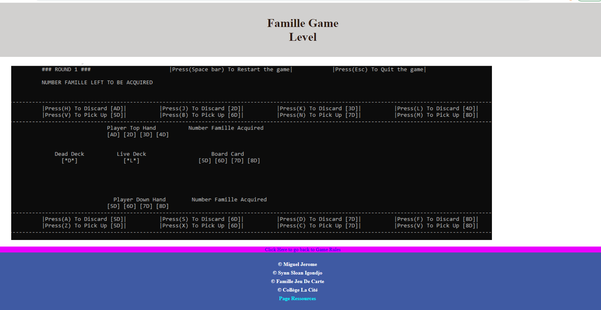

## FAMILLE CARD GAME

 

### Project Mock-up

* pdf
        -[MOCK-UP-GRAPHIC](./pdf/Instructions_B%20(1).pdf)
### Current Project State

* [Project-state](https://github.com/MiguelJerome/famille/issues)

### Project Ressources
* css
        - [style](./css/style.css)
* images
        - [poker-table](https://www.vecteezy.com/vector-art/6325236-poker-table-green-cloth-on-dark-background-vector-illustration)
* js
        - [script](./js/main.js)
* html
        - [index](index.html)
        - [gameLevel](gameLevel.html)
        - [gameObjective](gameObjective.html)

## FAMILLE CARD GAME

This is my FAMILLE CARD GAME website [link](https://migueljerome.github.io/famille/) 
You can have access to the ressources of my FAMILLE CARD GAME Web Page [this the link](https://github.com/MiguelJerome/famille) 

 ## Local launch on chrome browser
 [local-chrome](http://127.0.0.1:5500)